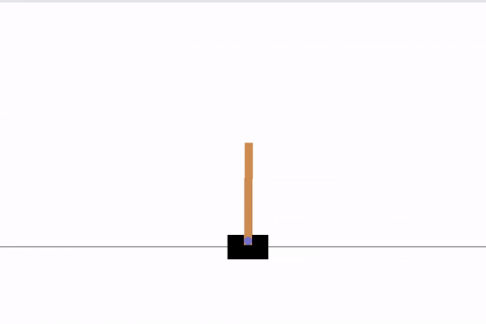

# DQN
My personal implementations of a **Deep Q-Network (DQN)**: *[Playing Atari with Deep Reinforcement Learning](https://www.cs.toronto.edu/~vmnih/docs/dqn.pdf)*, by Mnih et al. (2013). [[Paper summary](https://ansonwhho.github.io/personal-notes/2021/12/20/aip4-dqn.html)].

